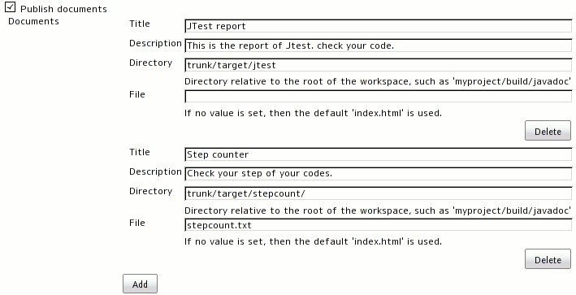

# Doclinks

## What does this do?

This plugin allows you to publish your documents that are created in the build steps as links on the project page.

## Configuration

### Project configuration

#### FreeStyle project

#### M2 project

If your project is M2 style, then you have to configure each modules.
You can see the links on the module pages, not project page.
